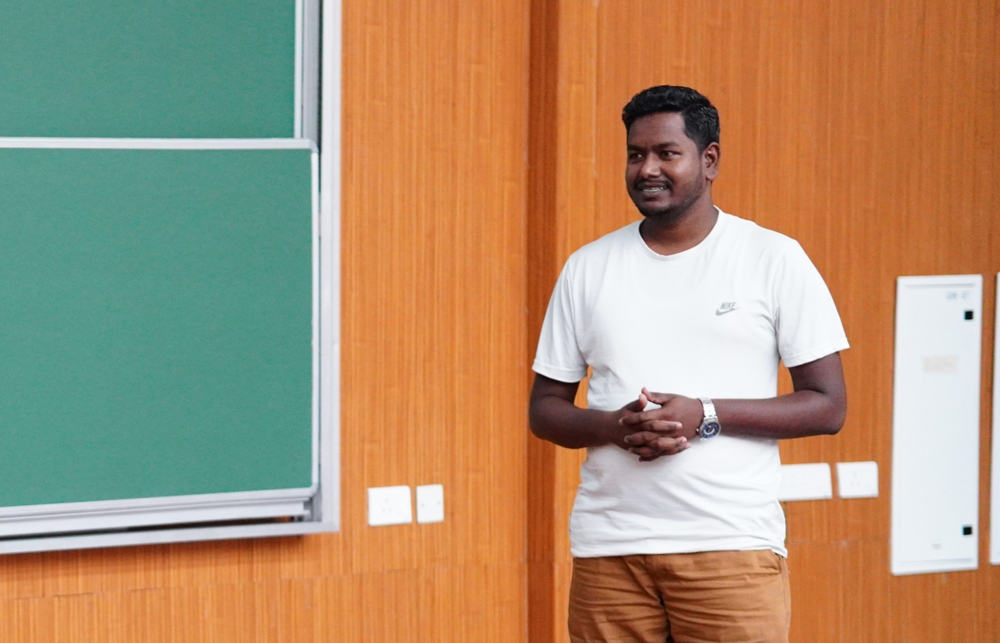

# Science Quest & Crystal-2023 

<figure class="image">
  
  <figcaption> It is a residential camp program conducted by IIT Palakkad. The camp's goal is to instil in students a spirit of inquiry, critical thinking, and love for science and mathematics. </figcaption>
</figure>

It is a residential camp program conducted by IIT Palakkad. The camp's goal is to instil in students a spirit of inquiry, critical thinking, and love for science and mathematics. 
