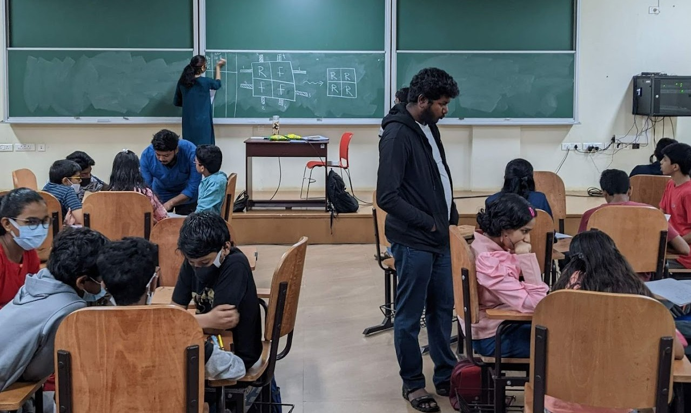
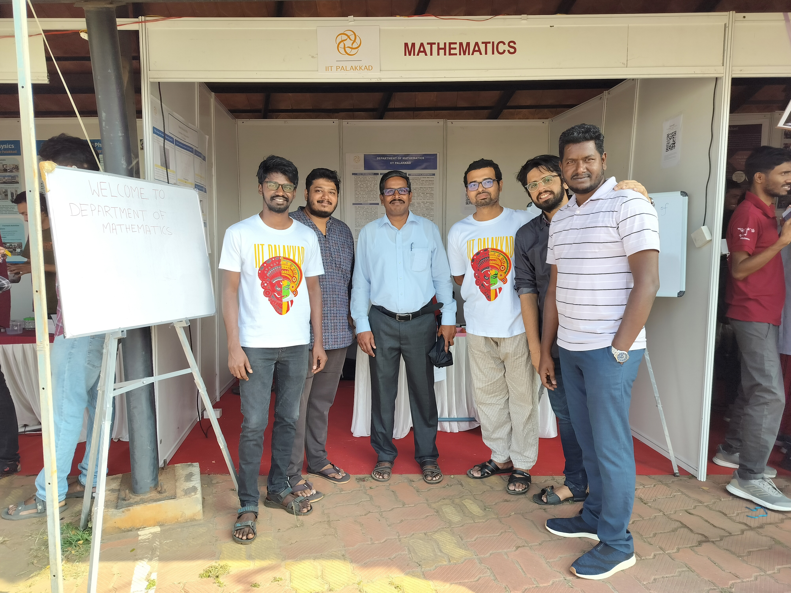
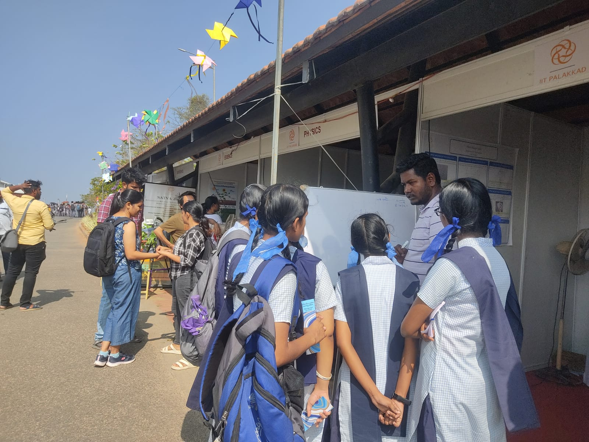

 <a href="index">Home</a> &nbsp; &nbsp; &nbsp; &nbsp; &nbsp; <a href="about">About Me</a>  &nbsp; &nbsp; &nbsp; &nbsp; &nbsp;   <a href="teaching">Teaching</a> &nbsp; &nbsp; &nbsp; &nbsp; &nbsp; <a href="research">Research</a> &nbsp; &nbsp; &nbsp; &nbsp; &nbsp; <a href="event">Events</a> &nbsp; &nbsp; &nbsp; &nbsp; &nbsp; <a href="activities">Activities</a> &nbsp; &nbsp; &nbsp; &nbsp; &nbsp; <a href="gallery">Gallery</a>   

   

### Science Quest & Crystal-2023 

 
It is a residential camp program conducted by IIT Palakkad. The camp's goal is to instil in students a spirit of inquiry, critical thinking, and love for science and mathematics. 

   

### Palakkad Math Circle 

 
It is an IIT Palakkad outreach initiative program for Class 8 and 9th school students. The fundamental goal of a Math Circle session is to engage kids and teach some mathematics concepts such as Puzzles, Logic etc.

   

### Open House at IIT Palakkad

 
The public will have an opportunity to visit the Institute and go around the campus to explore the exciting science and technology initiatives and activities of the Institute. The Open Day will feature popular lectures, experimental demos, poster presentations, quiz contests, scientific competitions, and exhibitions that will be showcased in the various departments. 
    
  A Group photo with Dr M Ashok Kumar (Associate Professor, Head & Dept. of Mathematics, IIT Palakkad)

  

 
A stall arrangement was given for the Department of Mathematics, and research scholars presented various problems like puzzles and logic to visitors. I had a fruitful discussion with school students about a puzzle, and it was a wonderful experience engaging with them.

 

