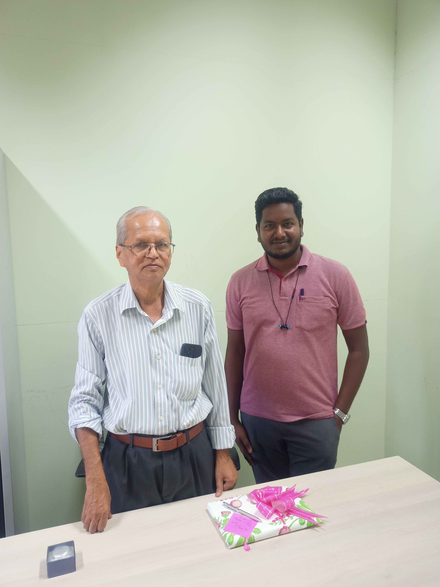

<a href="index" class="btn" style="display: inline-block; padding: 5px 10px; background-color: #157878; color: white; text-decoration: none; border-radius: 3px;">Home</a>  <a href="about" class="btn" style="display: inline-block; padding: 5px 10px; background-color: #157878; color: white; text-decoration: none; border-radius: 3px;">About Me</a> <a href="teaching" class="btn" style="display: inline-block; padding: 5px 10px; background-color: #157878; color: white; text-decoration: none; border-radius: 3px;">Teaching</a>  <a href="research" class="btn" style="display: inline-block; padding: 5px 10px; background-color: #157878; color: white; text-decoration: none; border-radius: 3px;">Research</a>  <a href="event" class="btn" style="display: inline-block; padding: 5px 10px; background-color: #157878; color: white; text-decoration: none; border-radius: 3px;">Events</a>  <a href="activities" class="btn" style="display: inline-block; padding: 5px 10px; background-color: #157878; color: white; text-decoration: none; border-radius: 3px;">Activities</a> <a href="gallery" class="btn" style="display: inline-block; padding: 5px 10px; background-color: #157878; color: white; text-decoration: none; border-radius: 3px;">Gallery</a>

 

<figure class="image">
  
  <figcaption align="center"> A memorable and cherished treat by Prof. V Muruganandham, Prof. S H Kulkarni, Dr Sarath Sasi, accompanied by my esteemed colleagues Ms Deblina Das, Mr Aditya Das </figcaption>
</figure>

 

<figure class="image">
  
  <figcaption align="center"> With <a href="https://publications.iitpkd.ac.in/researcher/s-h-kulkarni">Prof. S H Kulkarni</a> during his farewell at IIT Palakkad </figcaption>
</figure>
